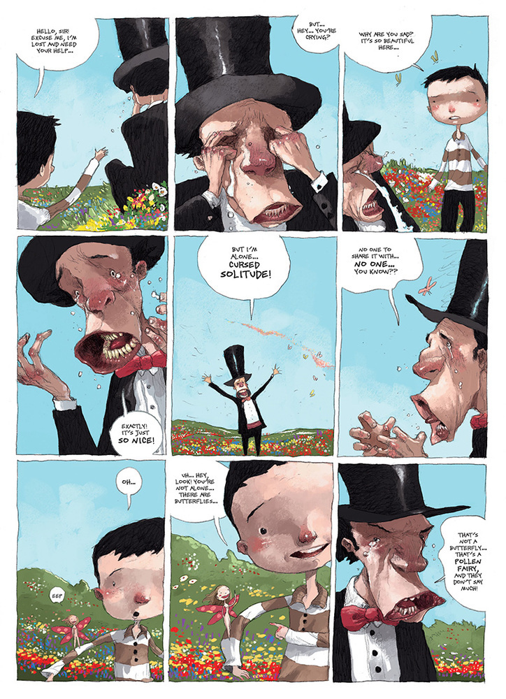

[Tony Sandoval](http://tonysandoval.deviantart.com/) är en mexikansk serieskapare som sedan 2008 har publicerat ett antal böcker på den franskspråkiga maknaden genom schweiziska [Éditions Paquet](http://www.paquet.li/bd/). På engelska kom förra året hans serie Doomboy, och nu kommer boken _A glance backward_, som han tecknat efter ett manus av Pierre Paquet (förläggare på Paquet).

===

Boken ges ut av amerikanska Magnetic Press, som bland annat publicerade den väldigt fina utgåvan av Doomboy. Den nya boken, [A glanced backward](http://magneticpress.bigcartel.com/product/a-glance-backward-by-pierre-paquet-and-tony-sandoval), utkommer i slutet av maj. På svenska finns _Liket och soffan_ utgivet av Epix förra året (nästan omöjlig att få tag på, men kolla med science fiction bokhandeln).

##Utdrag

