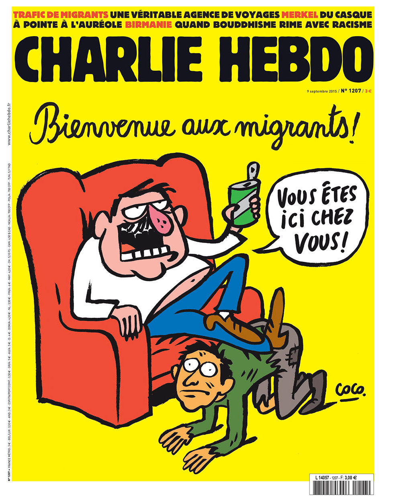
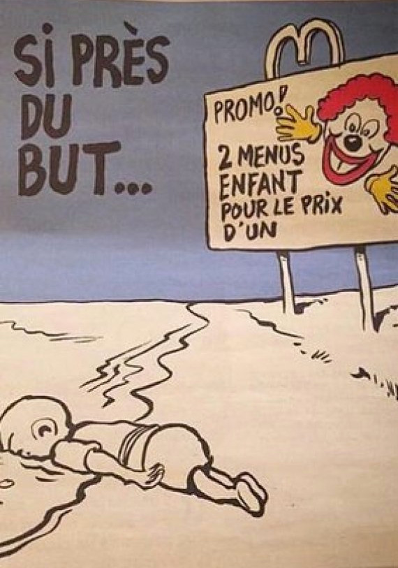
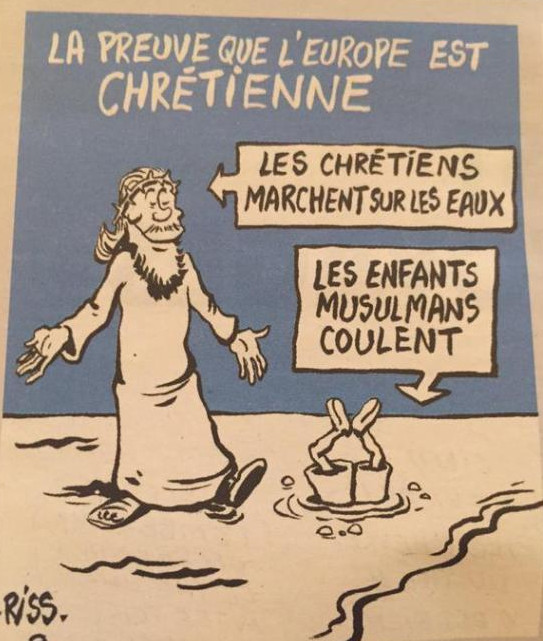
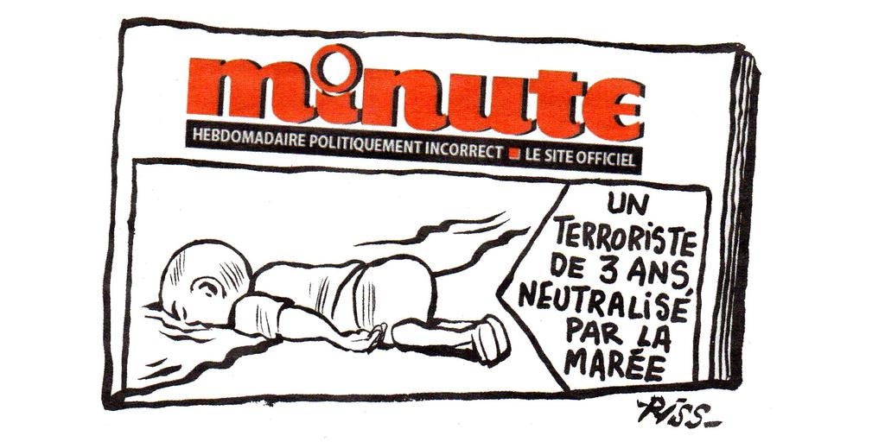

Så har åter en våg av Twittrare blivit upprörda över Charlie Hebdos satir, och åter verkar människor förstå ganska lite av det som de är upprörda över. Denna gång gäller det två bilder som kommenterar fotot och reaktionerna efter den treårige Alans död. (texten uppdaterad 15/9 8:20)

===

Att många utanför Frankrike har svårt att förstå vilken typ av tidning som Charlie Hebdo är, är i sig inte konstigt – tidningen är väldigt fransk i sin framtoning, och satiren är ofta mer avancerad och mer politiskt laddad än man är van vid i många länder – svensk satir är till exempel extremt mycket mer timid och tillrättalagd med ett fåtal exempel som sticker ut, som exempelvis Pontus Lundkvist och Far & Son.

Det var denna ganska låga kunskap om vad Charlie Hebdo egentligen är som gjorde att jag ägnade första numret av Sekvenser åt Charlies historia, för att försöka sätta ett sammanhang kring den typ av humor som de producerar – ofta skitig, elak och dum – och lika ofta väldigt politisk.

Nu är det många som menar att Charlie Hebdo driver med den döda pojken i det senaste numret av tidningen. Men det känns som om dessa människor inte kan ta till sig ett mer avancerat litterärt text än av slaget ”Ta't lugnt. Ta en Toy”, men ändå missförstå det och bli upprörda för att de känner sig kränkta av de inte får hetsa upp sig.

De två bilderna publicerades i numret som har fokus på immigrant-politiken i Europa. Ett icke förvånande tema då det minst sagt är ett hett ämne, inte minst efter publiceringen av bilden på Alan.

<blockquote cite="https://www.facebook.com/chaunu.fr/posts/994285100623434:0">Posted by <a href="https://www.facebook.com/chaunu.fr">Chaunu Emmanuel</a> on&nbsp;<a href="https://www.facebook.com/chaunu.fr/posts/994285100623434:0">den 3 september 2015</a></blockquote>

Jag har sett flera satirbilder som berör händelsen vid stranden senaste tiden, en av dem, som bilden ovan av Chaunu Emmanuel, där han placerat en skolväska på pojkens rygg – för att visa på att han är ett barn som vilket som helst, som likväl kunde vara på väg till skolan (Texten "De är tillbaka i skolan"). Det är också satir, men mer lågmäld än Charlie Hebdos satir brukar vara.

Immigrant-numret av Charlie Hebdo pryds på omslaget av en bild teckand av Coco och det föreställer en fransk man som sitter i en fåtölj med fötterna på en annan man med trasiga kläder på alla fyra, texten säger ”Vous êtes ici chez vous!” - ”Känn dig som hemma!”. Anslaget är här tydligt – detta är ett nummer som driver med den europeiska dubbelmoralen och den förda immigrationspolitiken. Man tar tydlig ställning för immigration och migranterna, och mot den hårdföra politiken som drivs för att hålla människor utanför Fort Europa.

Den ena av de två bilderna i tidningen föreställer pojken på stranden och en reklamskylt för McDonalds där det står ”2 barnmenyer för priset av 1”. Den bilden kan tolkas åt många olika håll, men att tolka den som att den driver med den döde pojken – det är något som inte finns täckning för i den. Bilden är för mig en tydlig kritik mot den europeiska konsumismen och kapitalismen som är beroende av alla dessa fattiga runt om i världen som drabbas av krig och svält på grund av att vi i Europa vill ha billiga varor, billig el och billig (utländsk) arbetskraft. Det är en omvärldsanalys sammanfattad till en liten bild.

Barn dör för att vi ska ha det bra, enkelt och billigt.

Den andra bilden föreställer en godhjärtad jesusfigur som går på vattnet medan pojken drunknar. Texten ovanför bilden lyder ”Beviset för att Europa är kristet”, och den följs med texten under som säger att ”kristna kan gå på vattnet” och ”muslimska barn sjunker”.  Den här bilden är för mig en kraftfull drift med den kristna dubbelmoralen – att vi ser oss själva som godare och bättre än de utanför. Först nu när många ”öppnar sina hjärtan” är det för att ett barn drunknade.

Bilderna är så tydliga de kan bli för mig – de tar ställning för de som behövt dö för den i Europa förda politiken, och driver med det hyckleri som många nu visar.

På annan plats i tidningen driver man med hur franska medier rapporterar kring bilden på Alan, som den fransk högertidningen _Minute_, texten säger "En terrorist mindre"

Det är inte alltid enkelt att förstå tecknad satir, vi läser in så mycket i bilder som vi själva tolkar, som inte finns där egentligen, och innan man tolkar en bild så behöver man ha på fötterna när det gäller kontext och syfte. Är det någon på fullt allvar som tror att en vänstertidskrift som tagit tydligt ställning för de svagare i samhället skulle driva med en liten oskyldig pojkes död? Nej, skulle väl inte tro det.

_Bilder: Copyright Charlie Hebdo._
