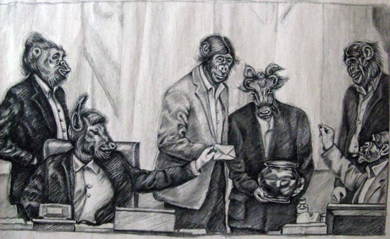

Hur makten behandlar sina kritiker är ett bra bevis på hur demokratin mår. När den iranska regimen fängslar och dömer aktivisten och satirtecknaren Atena Farghadani till 12 år och nio månaders fängelse är det inte bara ett övergrepp mot yttrandefriheten utan också ett hån mot demokratin. När man dessutom tvingar henne att genomgå ett så kallat oskuldhetstest och graviditetstest så är det ett övergrepp och diskriminering av henne som kvinna.

===

Atena Farghadani utnyttjade sin rätt som tänkande människa att driva med regimen i Iran, för detta har hon blivit samvetsfånge i en stat där demokratin i dag bara är ett ord.

Stöd Atena Farghadani genom att skriva på [Amnesty Internationals kampanj för att få henne fri](http://www.amnesty.se/engagera-dig/agera/manadens-aktion/). I november har man utsett denna kampanj till månadens aktion. Hör av även er till den svenska regeringen att de ska sätta tryck mot den iranska regimen. När terrordådet mot Charlie Hebdo skedde var det många som skyndade till för att försvara yttrandefriheten. Låt oss fortsätta med detta och visa att det även bör gälla i länder som Iran.

_Athenas satirteckning driver med den iranska regeringen när de röstar nej till fria preventivmedel och steriliseringar._
