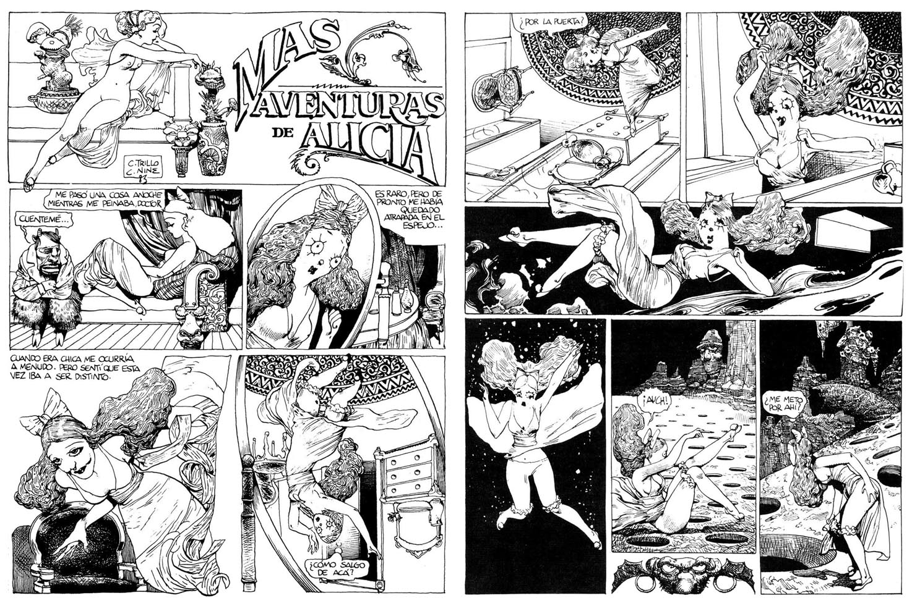

Carlos Nine var en Argentinsk målare, animatör, illustratör och serieskapare (bland annat). Hans bilder har prytt tidningar världen över, och när han på åttiotalet debuterade som serieskapare fick läsarna möta en säregen stil, mer inspirerad av det tidiga 1900-talets moderna konst och tecknade serier än de nutida mästarna.

===

Carlos Nine föddes 1944 i Haedo i provinsen Buenos Aires.  Efter att han utbildat sig på konsthögskolan i Buenos Aires började han att främst arbeta som illustratör. Carlos Nine kom relativt sent till de tecknade serierna i sin karriär, det var först i början av åttiotalet som han första tecknade serier publicerades.

De tidiga serierna, som bland annat trycktes i _Fierro_, _Humi_ och _Superhumor_ (och för modertidningen _Humor_ gjorde han bland annat en mängd karikatyrer, många av dem för omslagen), hade en hel del gemensamt med klassiska serieskapare som *Winsor McCay* och *George Herriman* och deras formexperiment, med en estetik som tar ett tydligt avsteg i Jugend och sedan går vidare in bland de surrealistiska konstnärerna och sedan tar en avstickare till de tidiga Disney-serierna.

I den passerade modernismen ligger något av nyckeln till Carlos Nines värld – med en nästan nostalgisk bild av en tid som inte längre finns. En underlig värld som befolkas av människor och djur, eller människoliknade djur, i alla möjliga och omöjliga former. De tidiga serierna kan inspirationen hittas i det tidiga 1900-talets serieexperiment, men snart fann han en stil som var hans egen, ofta blandtekniker – blyerts, akvarell, tusch osv.

_Tolkning av Alice i Underlandet_

Carlos Nine samarbetade ibland tidigt i sin seriekarriär med den likadeles argentinske serieskaparen och manusförfattaren *Carlos Trillo*, tillsamman gjorde de bland annat en tolkning av _Alice i underlandet_, men han arbetade också tillsammans med flera andra samtida landsmän, som *Dalmiro Saenz* och  *Juan Sasturain*. Under senare delen av sin karriär föredrog han dock att skriva sina egna manus.

Det var främst som illustratör som Carlos Nine gjorde sig ett namn, hans teckningar och målningar publicerades världen över. Hans illustrationer har brytt sidorna av New Yorker, Playboy, Le Monde och många andra. För sina illustrationer för böcker och reklamkampanjer har han fått flera viktiga priser världen över.

Att Carlos Nine fick en internationell karriär är kanske inte bara på grund av hans otroliga bilder, utan även på grund av den nästan eviga ekonomiska kris som Argentina befunnit sig i – han var mer eller mindre var tvungen att hitta uppdrag utanför landet för att kunna försörja sig..

I slutet av åttiotalet nådde hans serier Europa, och han publicerades bland annat i Italien, Spanien och Frankrike i tidningar som _L'echo des Savanes_, _Zona 84_ och _Comic Art_. Först de kortare serierna, men senare även längre berättelser, serier som ofta inte publicerades i hans hemland Argentina, men som fann en publik i främst Europa och Asien. Många av Carlos Nines serier var politiska, och att hans debut i seriebranchen mer eller mindre sammanfaller med militärdiktaturens upphörande i Argentina (1983), är ingen slump. Många av de berättelser som han tecknar, var mer eller mindre omöjliga innan. Politik är ett återkommande ämne (kanske mest renodlat i _Oh merde, les lapins!_ Som gavs ut 2002 och som är en satir över internationell politik), likaså sex.

Första gången Carlos Nine publicerade i ett album var 1990 i Spanien, i antologin _Chronicas de la Pampa Vasca_, med manus av Juan Sasturain. Året därefter gavs Carlos Nines egna _Meurtres et Chatiments_ ut på franska Albin Michel. Och det var i Frankrike som han mötte störst framgång som serieskapare. 1993 publicerades hans tolkning av svansjön (_Le Lac des Cygnes_) på Calligram, och 1995 _Fantagas_ på Delcourt (senare utgiven i vacker utgåva på *Les Rêveurs* 2007). När *L'Association* gjorde sin mäktiga antologi _Comix 2000_, med ett urval av världens främst serieskapare, var Carlos Nine en av de givna namnen. 2000 kom Carlos Nines kanske största framgång, _Le canard qui aimait les poules_, som skulle utses till bästa album på seriefestivalen i *Angoulême* året därefter. Boken kom i en ny delvis omarbetad upplaga 2009 på  Les Rêveurs, då under titeln, Saubon le petit canard. Serien hade dock från början publicerats i den argentinske tidningen _Fierro_.

En av de få serier som finns av Carlos Nine på engelska (på svenska finns inget utgivet) är ett album av _Donjon Monster_, som Carlos Nine tecknade till  manus av *Lewis Trondheim* och *Joann Sfar*, och som har getts ut av amerikanska NBM. Carlos Nine gjorde även en serie till antologin _Little Lit: It was a dark and stormy night_, och en serie av honom publicerades i den amerkanska varianten av _Metal Hurlant_ 2002, _”Spouting Off: The Random Thoughts of Jean-Pierre Dionnet”_.

I år gavs Carlos Nines senaste album ut – _Tropikal Mambo_, som bitvis är mer än illustrerad berättelse än en serie, och där Carlos Nine, trots över sjuttio år gammal, fortfarande förnyar sig. Varje kapitel i boken är tecknad i olika stil. Den handlar om en detektiv i Panama, en man som bryr sig föga om rättvisa, och som föredrar kvinnor och pengar framför något annat. I slutet av boken börjar detektiven konspirera mot författaren till boken, Carlos Nine, och det blir en historia där inte både två inte längre kan få plats – någon av dem måste bort.

Carlos Nines värld befolkad av sextörstande kvinnor, förvirrade korrumperade ankor i en svunnen tid försvinner inte ut i marginalen för att Carlos Nine nu inte längre finns ibland oss, han skapade en värld som vi närsomhelst åter kan (och bör) besöka, och förhoppningsvis kommer fler av hans serier av översätta till engelska så att ännu fler kan få möjlighet att upptäcka dem.

Carlos Nines son *Lucas Nine*, född 1975, är även hans serieskapare, och det jag sett av honom hittills lovar mycket gott – vem som är hans far går inte att ta miste på, och liksom sin far, så publicerades hans första bok, _Dingo Romero_, i Spanien.

En längre version av denna text kommer att publiceras i _Sekvenser_ 1+2 2016 som utkommer senare i år.
