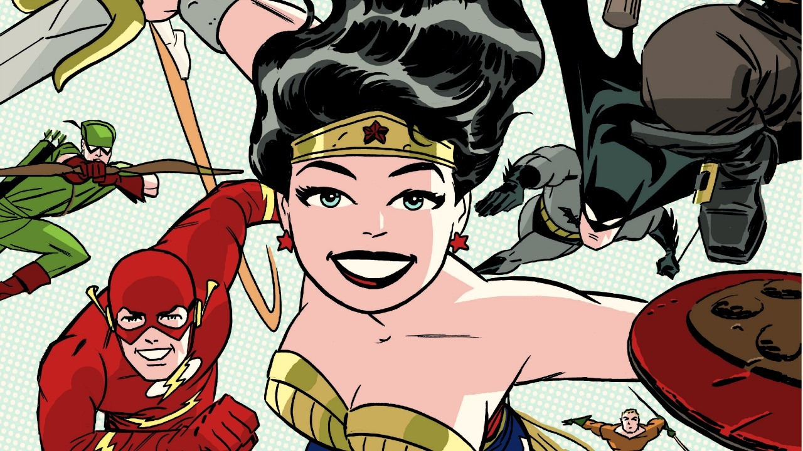
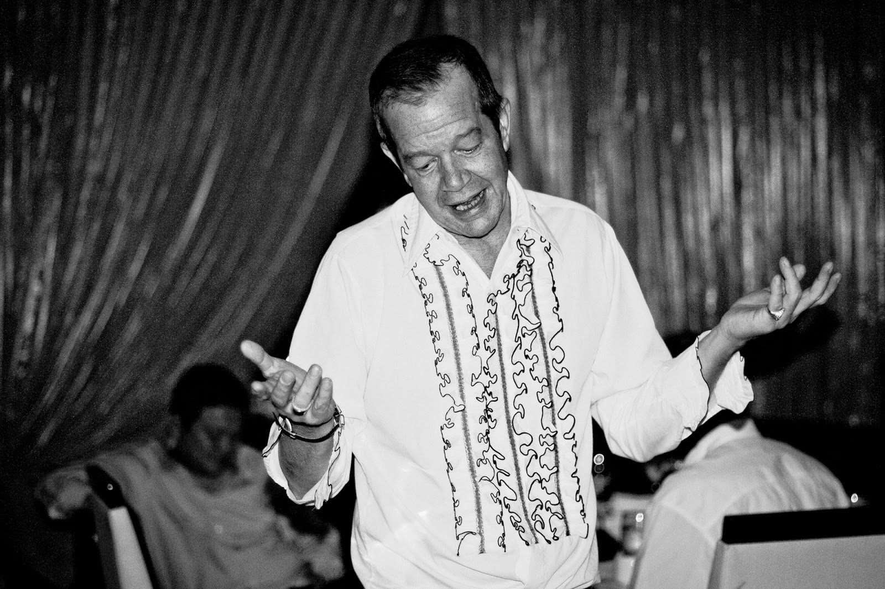
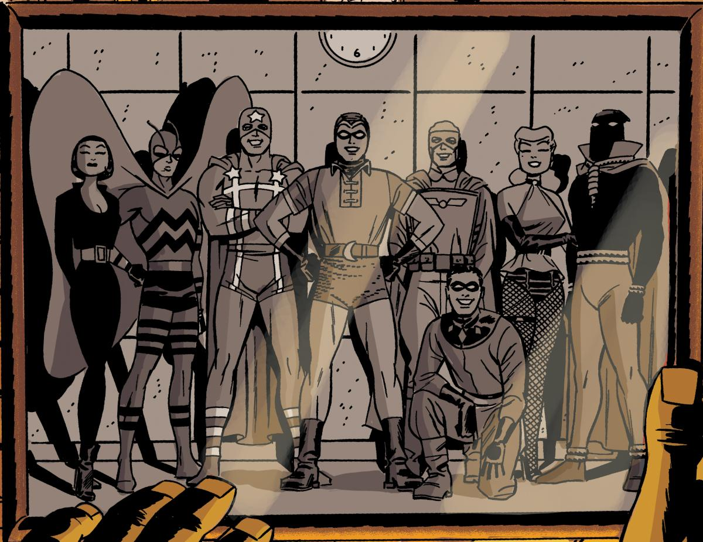

Den kanadensiske serieskaparen Darwyn Cooke har avlidit till följd av en aggressiv form av cancer. Darwyn Cooke var kanske mest känd för sitt arbete med DC och mini-serien _The New Frontier_.

===

Darwyn Cooke föddes i Toronto 1962, och debuterade med sin första serie i _New Talent Showcase_ 1985. Åren efter det gjorde han få serier och arbetade främst  som designer och tidningsredaktör. 1990 började han arbeta med animation, bland annat med Superman och Batman, efter att han försökt att få jobb som serieskapare på de stora förlagen, men funnit lite intresse för honom som tecknare.

I slutet av nittiotalet fick han dock arbete för DC, och den första serien han gjorde för dem var _Batman: Ego_ som kom 2000. 2001 så gjorde han tillsammans med manusförfattaren Ed Brubaker om Catwoman, först med serien _Trail of the Catwoman_, som gick i _Detective Comics_.

_The New Frontier_

Darwyn Cookes kanske mest kända serie är _The New Frontier_, en mini-serie som publicerades av DC 2004, som han både skrev och tecknade. _The New Frontier_ utspelas främst på femtiotalen och binder samman DC:s hjältar från Golden och Silver Age-tiden, med karaktärer som Wonder Woman, Batman, Flash och Green Lantern. Serien är flerfaldigt prisbelönad och finns i ett flertal olika utgåvor, bland annat en delux-utgåva som kom 2015. Den animerade filmen _Justice League: The New Frontier_, baserades på serien, och Cooke var med och skrev manus.

_Darwyn Cooke på en privat middag_

Darwyn Cooke gjorde ett flertal projekt för DC, och för tidningen _Solo_ (varje nummer var dedikerad till en serieskapare), så gjorde han det femte numret som han 2006 fick en Eisner för bästa enskilda nummer. 2009 började han att adaptera romaner av författaren Richard Stark (pseudonym för Donald E. Westlake), första var _The Hunter_. Det följdes ytterligare tre adaptioner, den sista var _The Score_, samtliga utgivna av IDW.

_Minutemen_

Darwyn Cooke skrev och tecknade _Before Watchmen: Minutemen_. _Before Watchmen: Silk Spectre_ som kom ut 2012-2013, skrevs av Cooke och Amanda Conner, som även tecknade.

Med manus av Gilbert Hernandez gjorde Cooke serien _Twilight Children_, som började att ges ut av DC:s etikett Vertigo 2015. 2015 kom även _Graphic Ink: The DC Comics Art Of Darwyn Cooke_, en två kilo tung samling i stort format som verkligen visar vilken fantastisk serieskapare Cooke var. Boken innehåller också ett flertal av alla de omslag som han tecknade för DC.
