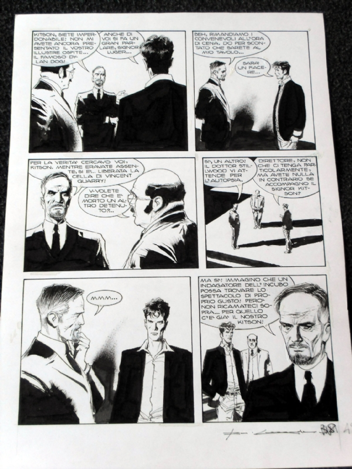

Första numret av skräck- och äventyrsserien Dylan Dog utkom i Italien i mitten av åttiotalet, och sedan dess bara fortsätter berättelserna att komma – senast jag kollade så hade det utkommit över 350 nummer av den ordinarie månadstidningen i Italien.

===

**Titel**: _Dylan Dog: Hellborn_

**Utgivning**: Ades Media 2015

**Språk**: Svenska

Albumet _Hellborn_ är något annorlunda en en normal Dylan Dog-berättelse  – denna löper på över 250 sidor, där de ordinarie berättelserna landar på runt 90 sidor, och klassar väl in på benämningen serieroman.

Titelns Hellborn är en fängelseö vid den brittiska kusten där livstidsfångar hamnar för att avtjäna sina straff och enda sättet de kan lämna fängelset är i en kista. Men det verkar som om något påskyndar processen, fångar dör på märkliga sätt, men av fängelseledningen klassas de oftast som självmord. Inte ens när ungefär en fånge i veckan avlider verkar de höja på ögonbrynen, det är när fängelset får en ny vice-direktör, Charlie Kitson, vän till kommissarie Bloch vid Scotland Yard, som förhållandena på fängelset blir mer uppenbara för någon utanför dess murar.

Bloch är på väg på en välförtjänt semester, och skickar sin vän mardrömsdetektiven Dylan Dog till Hellborn för att försöka hjälpa Kitson. Dylan Dog tas dock inte emot med en varm famn av övriga ledningen på fängelset. Och snart är Dylan Dog fast i en mardrömsvärld som han inte rår sig på. Hellborn är så mycket mer än ett fängelse, det verkar som om ondskan själv är dess nervsystem.

 _En orginalsida ur Hellborn_.

Till skillnad från ett normalt äventyr med Dylan Dog, som ofta är ganska rappa och snabbt avklarade, där man sällan kanske aldrig riktigt känner känslan av skräck, så när man här i _Hellborn_ mer tid på sig så är det lättare, det blir mer psykologi än vad som vanligtvis får plats, och man kan  känna den fruktan som upplevs på fängelseön.

Corrado Roi tecknar i en realistisk stil som klingar av klassiska krim- och äventyrsserier från sextiotalet och det tidiga sjuttiotalet. Stilen är fortfarande mycket populär i Italien, särskilt på det förlag som publicerar Dylan Dog,  Sergio Bonelli Editore. Corrado Roi är en vanligt återkommande tecknare för serien. Han tecknar även för bland annat Mister No och Martin Mystère, som utspelar sig i samma universum som Dylan Dog. Corrado Roi stil passar väl till Tito Faracis manus, som har  en stor del övernaturliga inslag. Tito Faraci är en välmeriterad italiensk manusförfattare som har jobbat med alltifrån _Stål-Kalle_ och _Diabolik_ (italiensk äventyrsserie) till _Spindelmannen_ och italienska västernserier.

Det är först på slutet som historien tappar något av sitt fokus, och det känns som om man haft lite för bråttom att knyta ihop påsen, och förklarar lite för mycket, men innan dess är jag helt med.

Hellborn är kanske inte är den bästa introduktionen till karaktärerna i serien Dylan Dog, jag rekommenderar att man läser några av de kortare albumen som finns på svenska innan denna, men annars, så rekommenderar jag Hellborn varmt.
