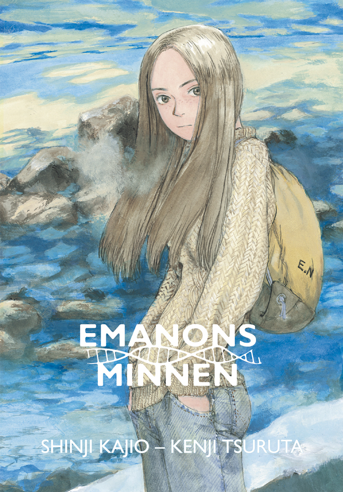

Shinji Kajio är en japansk författare som i hemlandet mest gjort sig känd för sina noveller och romaner som mest rör sig inom det fantastiska, det vill säga science-fiction och fantasy, och han har även skrivit manus för film, TV och teater. _Emanons minnen_ är från början en roman, som senare gav upphov till flera andra berättelser. Emanon är No name baklänges. Den namnlösa är en ung flicka, som inte är fyllda 20, men ändå bär med sig minnen från då det bara fanns mikroorganismer i haven.

===
Serieromanen _Emanons minnen_ är en bearbetning av romanen gjord av serieskaparen Kenji Tsuruta. Det var en bearbetning som höll på att stupa innan den knappt hade påbörjats, och det tog flera år för honom att slutföra serien. Ofta när vi får höra om japanska serieskapares arbeten så är det hur mycket de producerar och i vilken hög hastighet. Kenji Tsuruta är något av en motpol till det, och har bland annat kallats för ”redaktörers mardröm”, på grund av han ofta inte håller deadlines eller producerar i den takt som redaktörerna önskar.

Kenji Tsuruta är antagligen mest känd för sin serie _Spirit of Wonder_, som i väst har publicerats i USA på Black Horse. Den finns även som anime med några fristående filmer. Kanske på grund av sin låga produktionstakt och Kenji Tsuruta oförmåga att slutföra serier så har han aldrig riktigt slagit igenom stort, varken här eller i Japan. Men hans _Emanons Minnen_ är mästerlig. Det är en mycket vackert tecknad serieroman med ett väldigt genombearbetat manus. En berättelse om en tillfällig romans på sextiotalet, med en kvinna som kan ha funnits på jorden sedan livet uppstod.

Berättelsen flyter fram under natten på det japanska havet. Resan går mot Kyushu, den sydligaste av Japans fyra största öar. Kenji Tsuruta lyckas perfekt med att skapa känslan av färjans färd genom natten, den känns nästan fysisk. Om man stått och rökt en cigarett på en färjas däck och tittat ut i natten, så vet man precis hur det känns.

Emanon börjar att berätta sin berättelse för berättarjaget. Hennes berättelse har varken en början eller eller ett slut, den pågår. Hon berättar om att hon alltid funnits här, men att hon hela tiden föds på nytt, med de forna livens minnen intakta. Mötet med den unga mannen är evigt och kort som ett ögonblick. Här finns en dos österländsk filosofi, blandad med den science fiction som var populär på sextiotalet. Det är en romans på ett hav med också ett möte med oändligheten. En oändlighet som inte tar den vanliga formen av en gammal vis gubbe, utan av en ung kvinna i början av livet, Emanon.

Ordbilder har en unik utgivning, och Emanons Minnen tar en stark plats bland mycket annat bra som de har gett ut – deras mangautgivning håller hög klass även om vi tar ett europeiskt perspektiv. Kenji Tsuruta må vara en improduktiv serieskapare, men det är kvalitet istället för kvantitet. Om du kommer över hans _Spirit of Wonder_ rekommenderar jag den starkt om du gillar science fiction med spår av Jules Verne. _Emanons Minnen_ kan jag rekommendera till vem som helst.

Mikke Schirén
