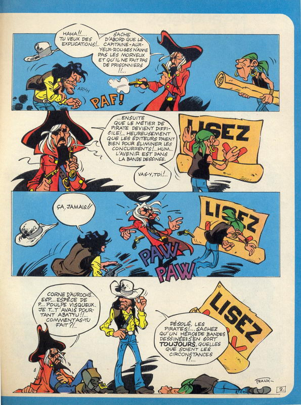
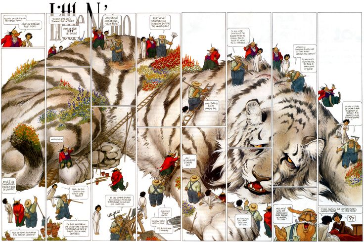
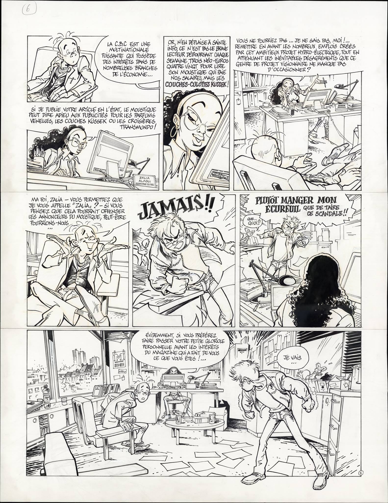

Vernissagen för den nya Frank Pé utställning på [CBBD i Bryssel]() ställdes in på grund av terrordåden i Bryssel. Men utställning har ändå öppnat, och bland det som ställs ut kan man bland annat se 15 sidor från ett kommande Spirou-album, och Pés tolkning av _Little Nemo_ 

===
[Frank Pé](http://www.frankpe.com/) föddes 1956 i Belgiska staden Ixelles, och han studerade skulptur på Saint-Luc Institute i Bryssel.

Frank Pé har arbetat med tidningen _Spirou_ sedan 1973, där han debuterade med i serien _Carte blanche_ (en "fri" serie i tidningen där man kan göra lite vad man vill, med många olika serieskapare som har bidragit). 

Frank Pé är kanska främst känd i den fransk-belgiska kulturen för serierna _Broussaille_	och _Zoo_, serier där djur och natur spelar en stor roll i serierna - djur och natur är starka teman i hans serier.

Under åttiotalet tecknade Pé korta strippar med Spirou för brevsidan i tidningen, men han har aldrig gjort en längre serie med Spirou. Nu är det dock dags för det, i den fristående serie med album som vänder sig till lite äldre läsare, som i Sverige har publicerats av förlaget Cobolt. Flera sidor från det kommande albumet ställs ut på CBBD. När albumet publiceras på franska är ännu inte klart vad jag har förstått. Om det sedan kommer på svenska får framtiden utvisa.

_Carte Blanch från tidningen Spirou_

_Från Little Nemo_

_Utdrag ur kommand Spirou-äventyr_

Fler sidor från Spirou-äventyret hittar ni på [Spirou reporter](http://spiroureporter.net/2016/03/24/frank-from-brussels-to-borneo/), en intervju med Frank Pé som gjorts i samband med utställning hittar ni (på franska) på  Branchés Culture, [del 1](http://branchesculture.com/2016/03/21/interview-de-frank-pe-exposition-centre-belge-de-la-bd/) och [del 2](http://branchesculture.com/2016/03/22/interview-de-frank-pe-partie-2-exposition-centre-belge-bd/).