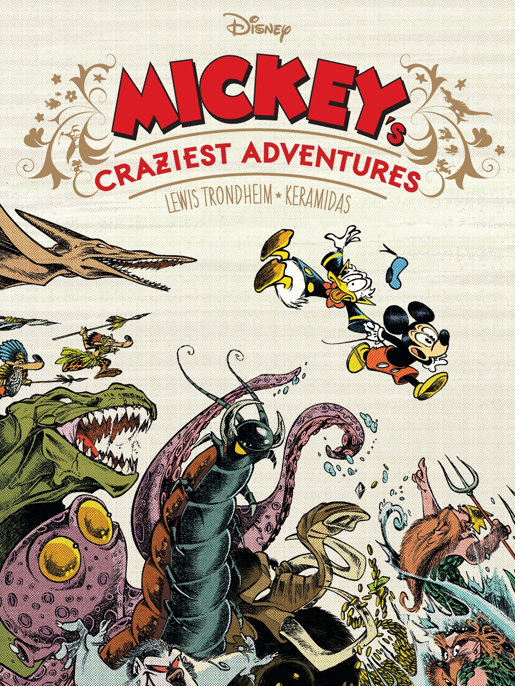
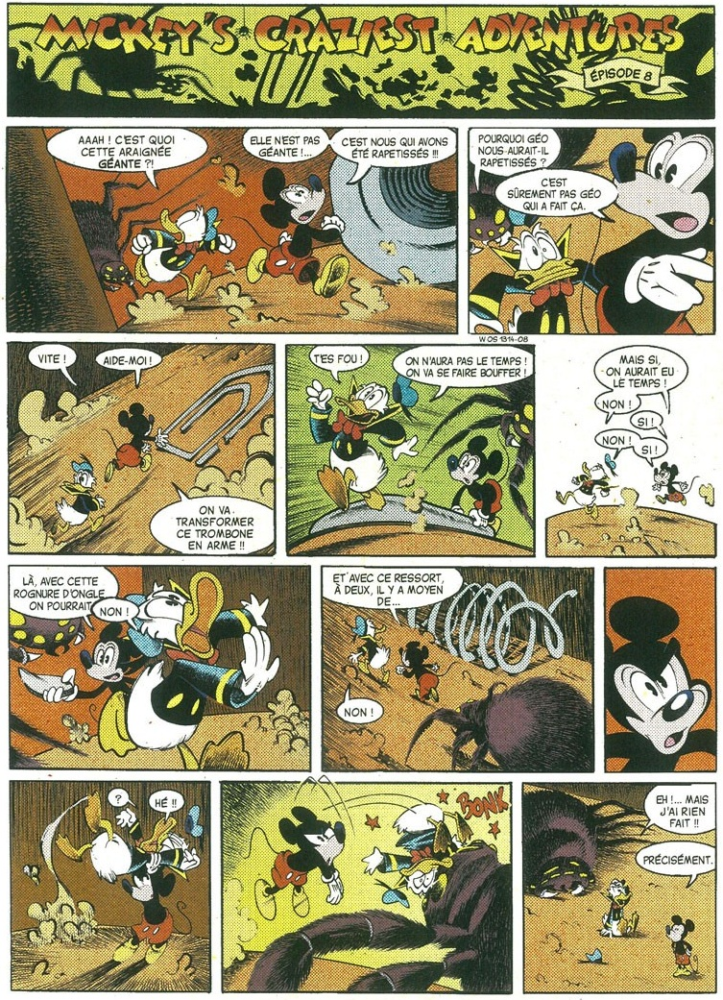

Det franska förlaget Glénat publicerar ett antal specialalbum med _Musse Pigg_, och man har bjudit in flera framstående serieskapare till satsningen. I _Mickey's Craziest Adventures_ står Lewis Trondheim för manus och Nicolas Keramidas för teckningarna. 

===

Albumet utkom i början av mars, då även ett annat hyllningsalbum släpptes av Bernard Cosey, _Une mystérieuse mélodie : ou comment Mickey rencontra Minnie_.

Nicolas Keramidas har tidigare arbetat som animatör för Disney, och har samarbetat med Lewis Trondheim i ett album av serien _Donjon Monsters_.

