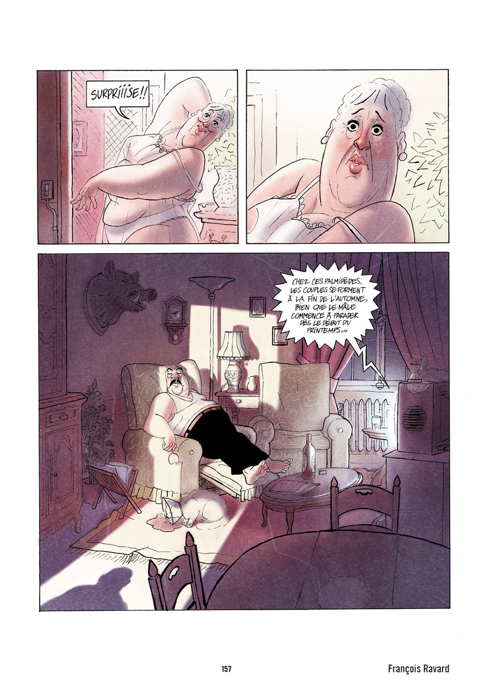
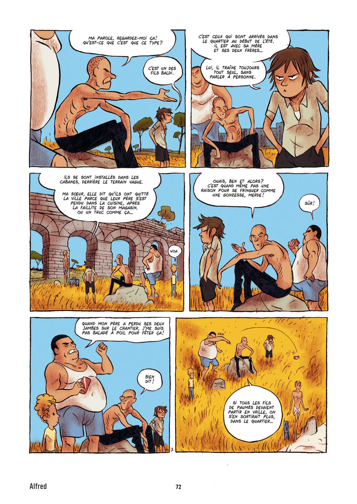
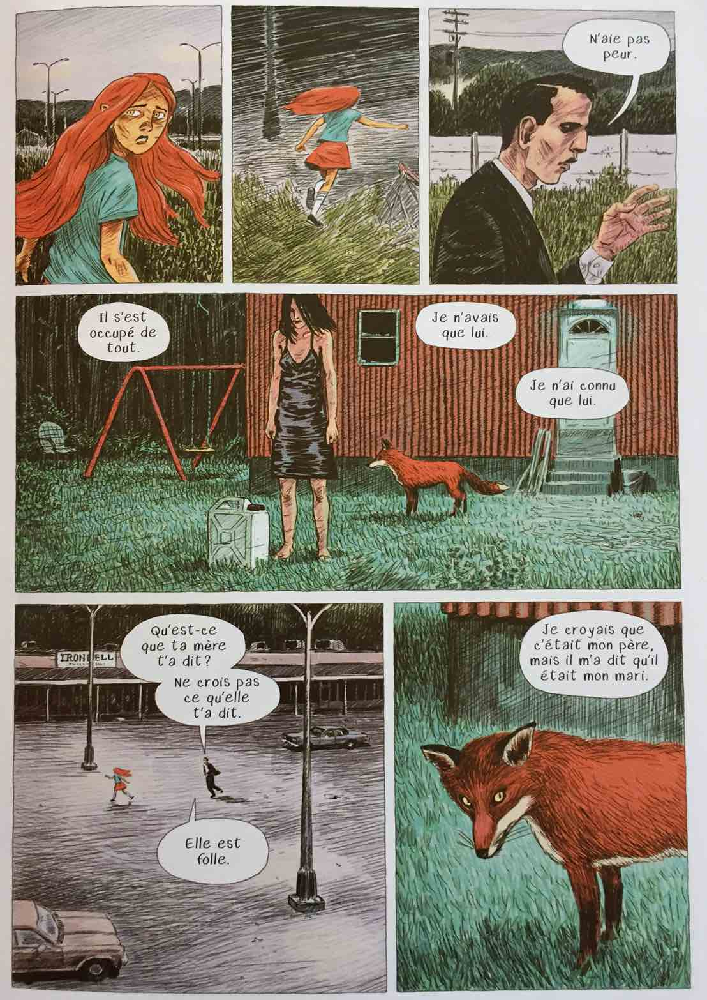
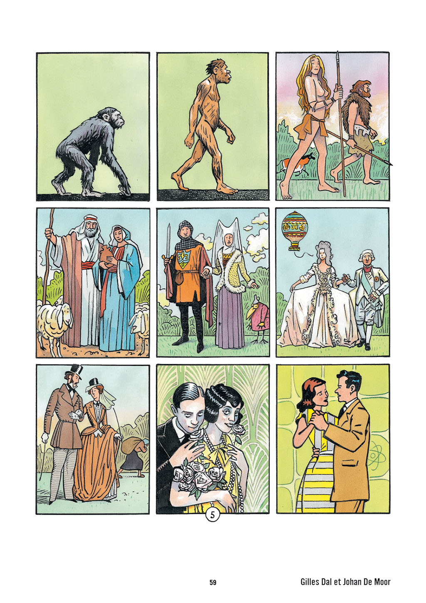
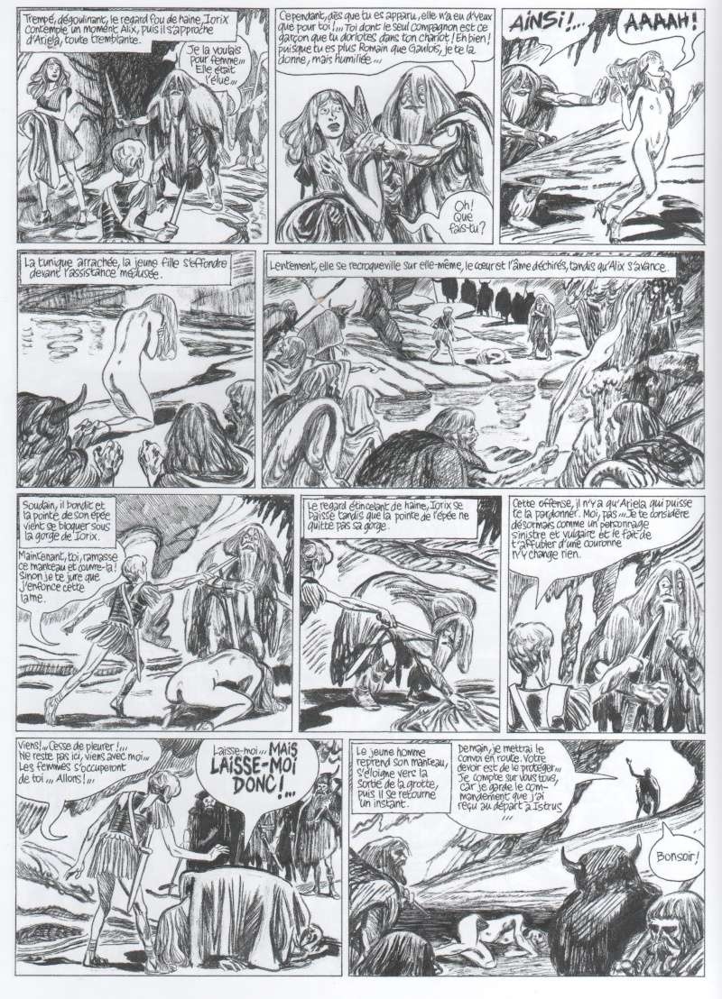

Arton år efter att Casterman la ned sin i dag legendariska tidning _(A Suivire)_ (sv. fortsättnng följer) så kommer man nu med en ny tidning, _Pandora_. Till skillnad från _(A Suivire)_ är det nu avslutade serier som är i fokus. Och det är nog bäst med tanke på utgivningstakten – två nummer per år.

===

Första numret är på 264 sidor färg och svartvitt och serierna i numret ligger från 1 till 20 sidor. Pandor kommer främst säljas hos bokhandlare, men den kommer även att finnas hos ett antal tidningskiosker, och kan till exempel beställas från Amazon.

I första numret medverkar Alfred, Denis Bajram, Blutch, Eleanor Davis, Johan De Moor, Florence Dupré la Tour, Jean-Claude Götting, Jean Harambat, Patrice Killoffer, Jacques de Loustal, Valérie Mangin, Ronan Toulhoat, Lorenzo Mattotti, Jean-Christophe Menu, Katsuhiro Otomo, Anthony Pastor, Michel Pirus, Ville Ranta, Aapo Rapi, François Ravard, Christian Rossi, Géraldine Bindi, Art Spiegelman, Terreur Graphique, Jean-Louis Tripp, Fabio Viscigliosi, Bastien Vivès, Matthias Lehmann, Isabelle Merlet, Brigitte Fontaine och Olivia Clavel.

Tanken med _Pandora_ är att ge både väletablerade äldre serieskapare liksom nyare en plats att göra serier på som inte är albumlånga, och där man ska kunna experimentera mer fritt. Något som bland annat även de numera nedlagda Papier (som vi skrev om i andra numret av _Sekvenser_) försökte vara.

Förutom serier publicerar man även illustrerade noveller, artiklar och essäer. Redaktör för tidningen är Benoît Mouchart, som tidigare bland annat har varit programansvarig på seriefestivalen i Angoulême.

_Nedan, utdrag med serier ur numret_

