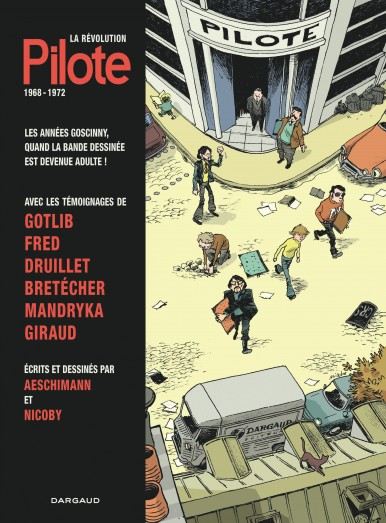

Den stora utvecklingen på slutet av sextiotalet av den franska seriemarknaden tog sitt avstamp i den i dag legendariska tidningen _Pilote_, och nu har det kommit en bok om den utveckling som skedde mellan 1968-1972

===

Seriereportaget som genre står stark i Frankrike, bland annat genom tidningen [_La Revue Dessinée_](http://www.larevuedessinee.fr/), som startades 2013, men genren har generellt haft en viktig ställning i den franska kulturen - kanske främst genom biografiska serier om allt från Nietzsche till fotboll. Därför är det inte förvånade att historien om de fyra viktigaste åren om tidningen _Pilote_ berättas i serieform.

Boken La Révolution Pilote om åren 1968-1972 är tecknad av Nicoby och har manus av Éric Aeschimann. Manuset bygger bland annat på intervjuer med de som var med på den tiden, som Gotlib, Fred, Druillet med flera. Fokuset kring 1968-1972 (tidningen startades 1959 pch lades ned 1989) bygger på det faktum att de serieskapare som då arbetade på tidningen är i mångt och mycket de samma som skapade grunden till det som vi ser som franska serier för vuxna i dag. Många av skaparna skulle gå vidare från _Pilote_ till tidningar som _Métal Hurlant_ och _L'echo des savanes_ då konflikyterna med redaktören Goscinny blev för stora.
