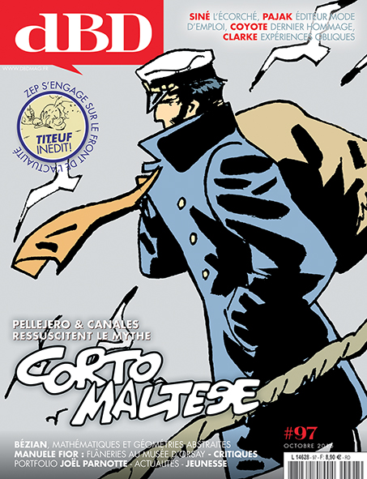

Något som jag ofta slås av när jag läser _Bild & Bubbla_ är ledaren, där skrivs det ofta om att det är "nu det händer, nu!". Nu i detta nummer, 3/3015, är det som förlag börjat att ge ut översatta serier från franska - något som upprepades även för några år sedan om jag minns rätt (då mitt eget Komika förlag var inblandat). Det är som man hela tiden inväntar att något större ska hända inom seriekulturen, men att det egentligen inte händer. Och att man till nästa nummer hoppas, att nu är det väl ändå som det ska hända.

===

Bild & Bubbla är upprepningarnas tidskrift, man kör sitt mantra om att serier minsann är bra, och är för vuxna, och för barn, och förklarar ganska grundläggande varför - samma saker som vi har hört så många gånger förr. Jag får allt mer intryck av att ett nummer av _Bild & Bubbla_ görs utifrån premissen att man antar att majoriteten av läsarna inte har läst tidskriften tidigare - något som verkar märkligt då det är en tidskrift som främst läses av de som är medlemmar i Seriefrämjandet, (vilket i dagsläget är strax över 800 personer). Tilltalet blir ibland, tyvärr, nästan infantilt. Som om man inte litar på de egna läsarna.

En del av upprepningen i det här numret är en intervju med Sture Hegerfors, med anledning av att Svenska Serieakademin fyller 50 år. Sture har inte så mycket mer att tillägga än vid 40-års intervjun. Dock är det inte Sture Hegerfors fel, det är själva fokuset som är fel, att just göra en intervju om jubilaren. Igen. Det hade till exempel varit intressant med en jämförelse på vad som hänt på de femtio åren, att se på samhällsutvecklingen, att dyka ned i detaljer. Inta rada upp samma anekdoter som alltid görs.

I aktuellt-blocket får vi läsa saker som att snart är det sommar och dags för Almedalsveckan - att tidskriften kom ut under hösten lagom till bokmässan bekommer icke. Vi får också läsa ett märkligt utdrag ur ett spanskt upprop för serieskapare. Trots att skribenten har som uppgift att bevaka Spanien så kan den varken spanska eller hittar någon som kan översätta åt hen. Google translate får rycka ut och vi får vet att i Spanien så är situationen för serierna "som slår i våra privata händer" och "fogar görs cisco". Trots att _Bild & Bubbla_ för varje nummer har en budget på över 80000 och en av de tidskrifter som får mest stöd från Statens Kulturråd, så kan man alltså inte ta ett land som man bevakar på så stort allvar att man hittar någon som kan översätta från spanska. Det här är inte att ta seriemediet eller serieskapare på allvar, det är nästan att driva med alltihopa. Lite hoppsan, hejsan.

Intervjuerna i numret har mest karaktären av fråga-svar och det blir ofta väldigt statiskt - till exempel i intervjuerna med serieskaparen Lisa Wool-Rim Sjöblom och förläggaren Lisa Wibom - inga uppföljande frågor eller reaktioner på det som den intervjuade sagt, det blir som en trist rapport, som svararen fyllt i. Det saknas ofta ett journalistiskt anslag, helt enkelt. Den franska serieskaparen David B. intervjuas och jag förstår mig inte på ett flertal av frågorna, och svaren är väldigt kortfattade, som om intervjuaren inte hinner lyssna klart på David B. innan nästa fråga ställs. Vi får aldrig veta så mycket om David B.,  egentligen.

Det stora undantaget i numret är Morten Harpers intervju med Alison Bechdel. Intressant skrivet, med en intervjuare som lyssnar på den hen pratar med (dock så saknas info att hennes senaste bok kommer ut på Placebo Press – det är ”faran” med översatta artiklar om de redaktionellt inte bearbetats – förankringen saknas då). Morten Harper har en nyfikenhet inför Alison Bechdel som person, och hennes skapande – och vi får också svar på vad hon anser om Bechdel-testet.

_Bild & Bubblas formmässiga kusin_

Redaktionen gjorde en omgörning av formen inför första numret i år, och det som har varit tydligt är att det nu har blivit mycket tomma vita ytor och ofta ganska intetsägande stora porträttbilder av intervjuade och övriga. Numret går väldigt snabbt att läsa, trots sina 100 sidor. Att man efter omgörningen ser ut som en kopia av franska _dBD_ stjälper snarare än hjälper - där _dBD_ är fullmatad med information och med bra bildredaktörer blir det i den svenska versionen _Bild & Bubbla_ mest bara ett "jaha" med en stor vit hånande yta bredvid.

Recensionsavdelningen i tidskriften verkar leva en borttynande tillvaro. Seriefanzine-recensionerna har man försökt flytta ut på webben - men inte lyckats lägga ut mer än tre recensioner (kollat 22 oktober 2015) sedan webbplatsen seriefanzine.se lanserades sommaren 2011. Recensionerna i _Bild & Bubbla_ av den vanliga serieutgivningen håller tyvärr ofta en ganska låg nivå - det är förvånade att i en tidskrift som säger försöka lyfta fram seriemediet 2015 få läsa "Vid det här laget ska det väl inte behövas säga att varken sagor eller serier nödvändigtvis är för barn" (men säg det inte då!) eller "Det verkar just nu finnas en trend inom serievärlden att rita lite skevt och enkelt, nästan fult". Facepalm på det.

Jag ska inte fortsätta att rabbla upp innehållet. Men _Bild & Bubbla_ är en tidskrift som verkar ha en redaktion som helt verkar ha tappat lusten. De enskilda skribenternas misstag eller tillfälliga okunskap är i sig inte ett problem om det finns en redaktion som tar hand om det. Men allt verkar gå igenom - man använder inte ens ett gemensamt språkbruk genom tidningen. Slarv och upprepningar. Bakläxa på det här. Gör om, gör rätt. I nästa nummer läser jag att det bland annat ska handla om Orup i tecknade serier. Det känns som om redaktionen behöver en rejäl burk viagra för att återfå lusten till seriekonsten.
