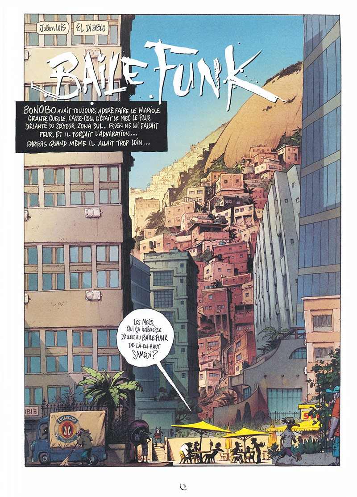

_Noticias_ är det första album med nya albumserien _Rua Viva!_, och det  är en samling med berättelser som utspelar sig bland de fattigare i Rio. Bland ren misär, knarkkrig och fattigdom försöker människor leva sina liv, och hitta ljuspunkter.

===

Manus är skrivet av El Diablo och tecknat av Julien Loïs och utgiven av franska AAARG! - som annars mest är kända för att publicera en antologi med samma namn som förlaget (presentation av antologin kommer i andra numret av Sekvenser).

Har sett flera serier som Julien Loïs har färlagt tidigare, men inget av hans egna verk, och av de sidor jag har sett av _Rua Viva!_ så ser det intressant ut.

