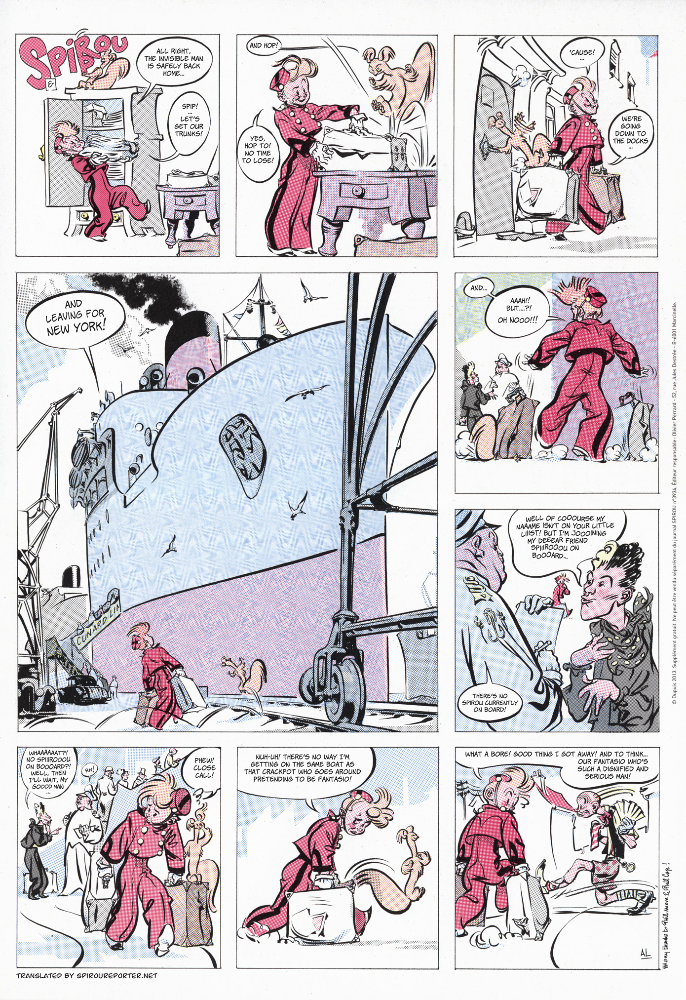
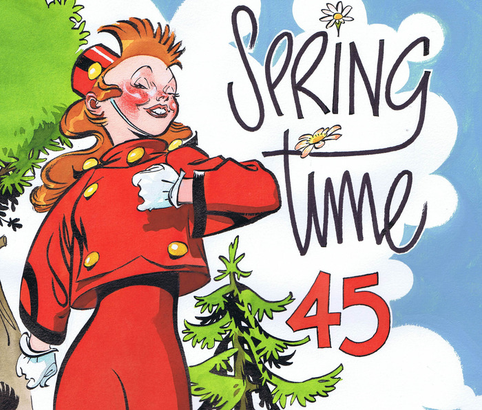
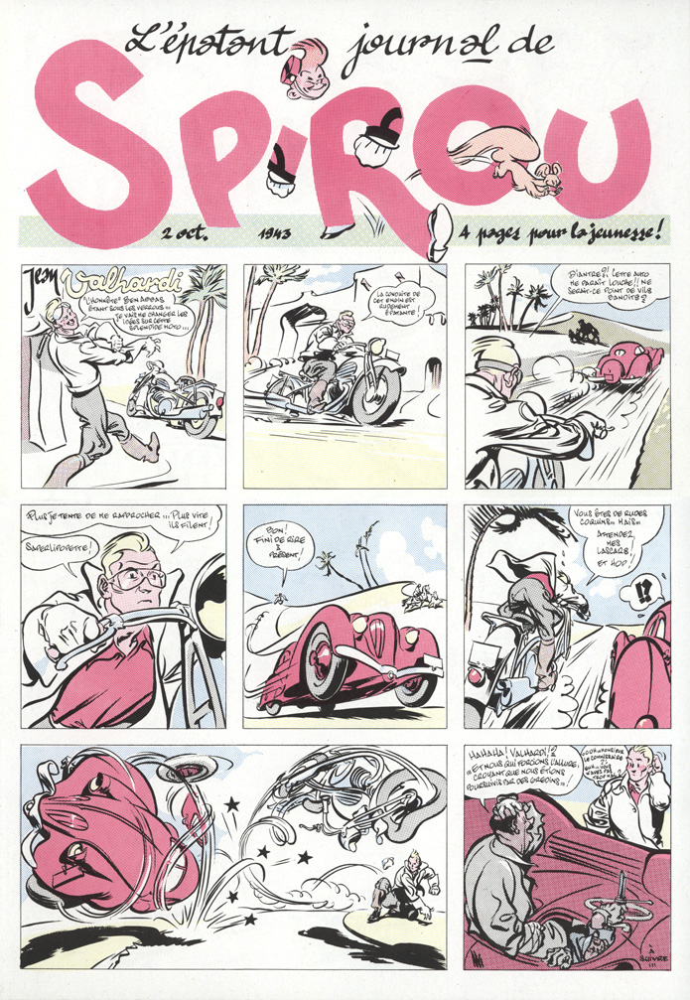
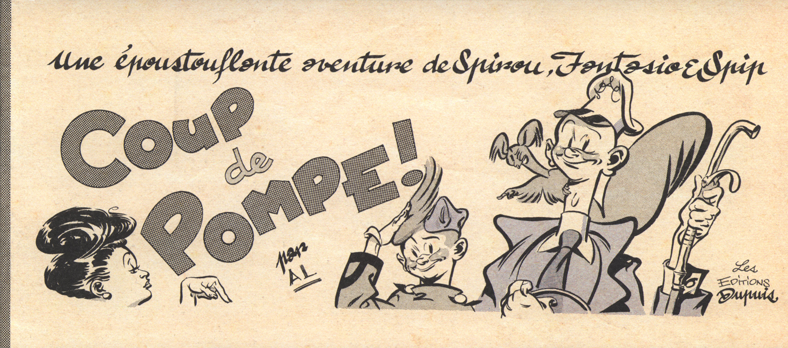
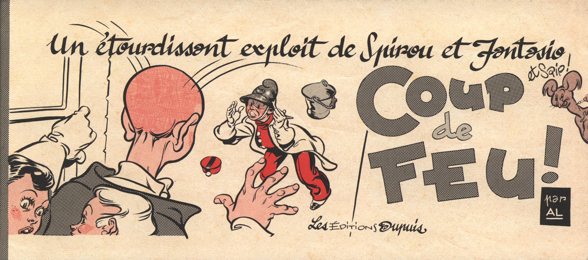

Serieskaparen Al Severin har bland annat gjort en bok med illustrationer, korta serier och skämtteckningar inspirerade av tidiga _Spirou_ (Spirou sous le manteau), och det ryktas om att han ska göra en längre historia i den fristående serien, som i Sverige publiceras av Cobolt.

===

Om det bara funnit nostalgi i Severins Spirou-teckningar så hade det kanske varit kul, men kanske inte så intressant in längden. Jag tycker att han tillför något till den äldre stilen som gör att det samtidigt som man känner den äldre tidens Spirou också får något mer. Det är inte bara tomma pastischer. 

Här några sidor med Al Severins Spirou.

