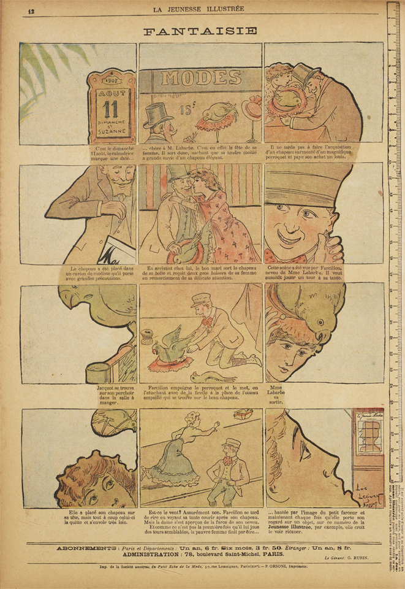

_Fantasie_ är ett bra exempel på att att ett avancerat bildberättande existerade i Europa i början av 1900-talet. Serien är skapad av Luc Leguey, som var en franska satirtecknare och serieskapare som tecknade för flera tidningar och tidskrifter i början av 1900-talet, som _Le Gil Blas Illustré, _Pages Folles, _Le Rire_, och _Le Frou-Frou_.

===

Sidan gjorde han för barn och ungdomstidningen La Jeunesse illustrée, och den publicerades i nummer 243, som kom ut 20 oktober 1907. Jag är djupt fascinerad över kompositionen på sidan. Samtidigt som det är en sekvensberättelse, får vi också hela huvudet på karaktären som har fantasin som serien handlar om.

Mer om serien kan [läsas på Töppferiana](http://www.topfferiana.fr/2011/12/fantaisie-par-luc-leguey-2/)
