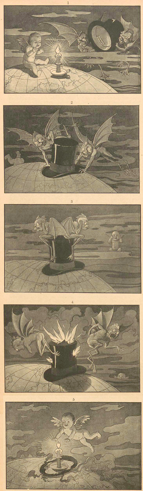

_Simplicissimus_ var en av Europas främsta satidskrifter, och vi hittar en hel del exempel på tidiga serier innanför dess sidor.

===

Denna serie från andra numret av veckotidningen, som utkom i April 1896 har med denna vackert tecknade serie, som jag inte riktigt kan tolka. Jag antar att ljuset är placerat på ett land eller ett område där något hände då, som denna serie kommenterar. Jag lyckas inte heller utlösa vem som är tecknare.

PDF för hela numret [hittar ni här](http://www.simplicissimus.info/uploads/tx_lombkswjournaldb/pdf/1/01/01_02.pdf).
