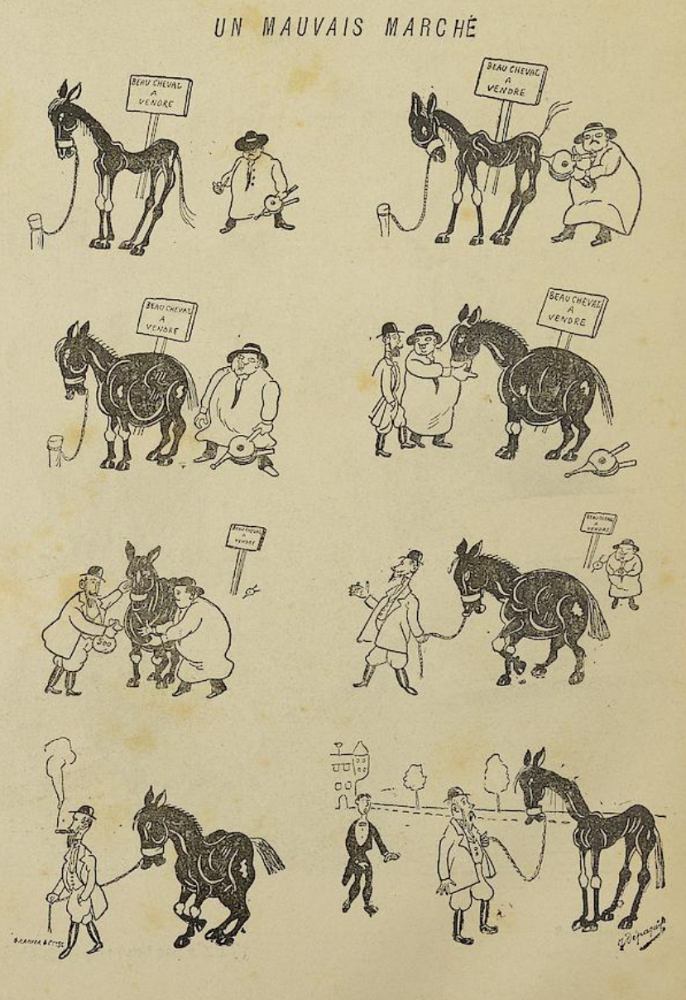

Jag kommer att börja med en serie bloggposter med exempel på tidiga serier, och det första exempel kommer från första numret av den franska satirtidningen _Le rire_ (Skratt), som började att publiceras 1894, mitt under "La Belle Époque".

===

Den enkla skämtserien "Un mauvais Marché", är på sitt simpla vis tidslös, vi förstår skämtet än i dag, och varianter av samma skämt tecknas fortfarande. Jag har tyvärr inte kunnat utläsa tecknarens namn.

PDF för hela numret [hittar ni här](file:///home/mikke/Skrivbord/forget-me-not/rire1894_1895_0007-0017.pdf).
