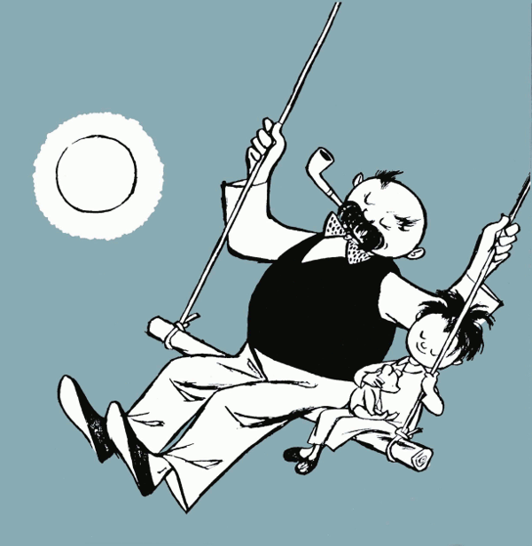

[Vater und Sohn](http://vaterundsohn.de/) av serieskaparen [E. O. Plauen](http://e.o.plauen.de/) (signatur för Erich Ohser) var en en populär ordlös tysk serie som publicerades mellan 1934-1937.

===

_Teckning av Vater und Sohn av E. O. Plauen_

Serien slutade att publiceras 1937 då serieskaparen inte såg hur han skulle kunna fortsätta med nazisterna vid makten. Men nu får den nytt liv med nya tecknare.

Det är den franska serieksparen [Marc Lizano](http://marc-lizano.weebly.com/) som tillsammans med tyska serieskaparen Ulf K. (publicerad i Sverige med Hieronymus B. 1997-2007) som åter har tagit upp serien, och en bok med kommer att publiceras i september på tyska [Panini Verlag](https://www.paninicomics.de/).
