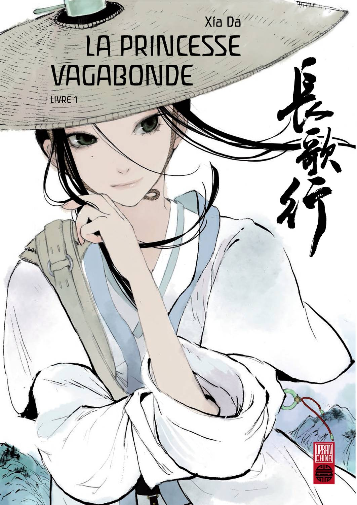
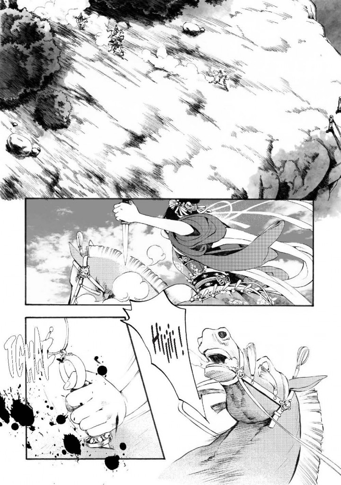
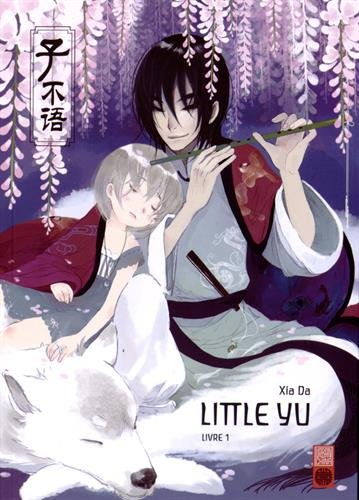
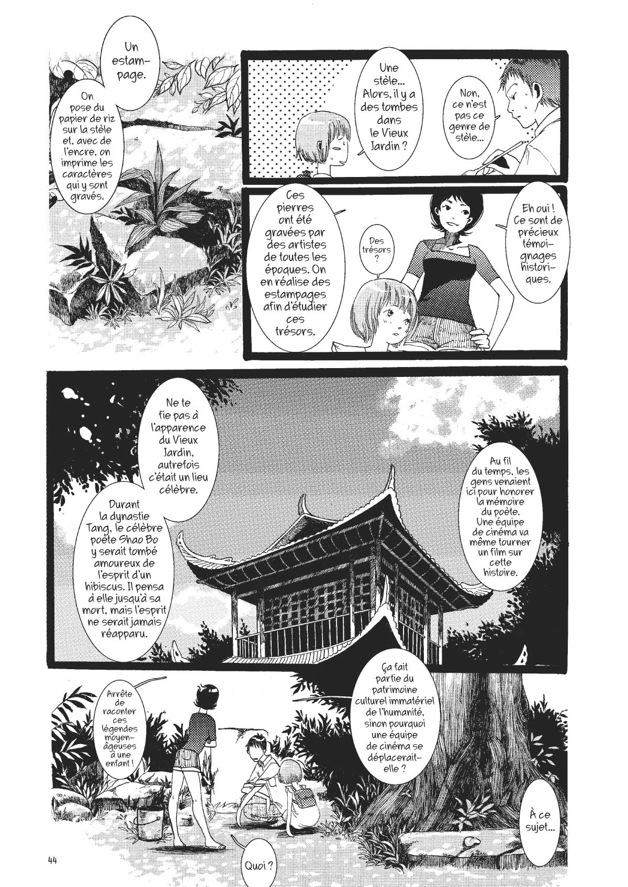
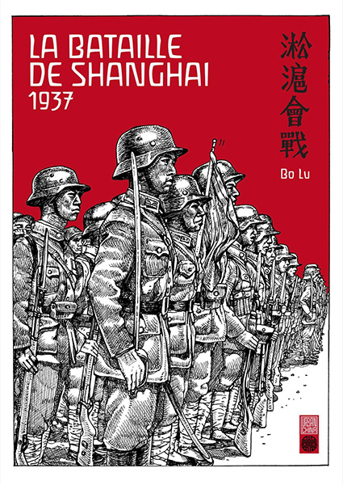
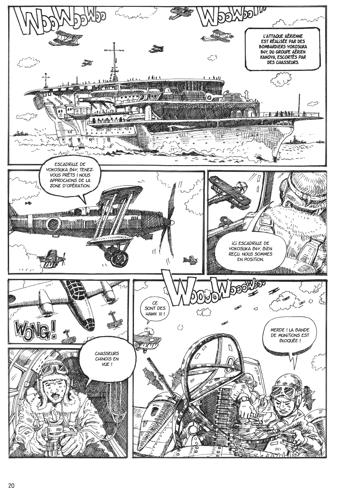

Urban China är ett joint-venture mellan franska Dargaud och kinesiska [Comicfans](http://comicfans.net/), som ska se till att sprida kinesiska serier, Manhua, till Europa.

===

Comicfans är det största kinesiska serieförlaget som bland annat ger ut tidningen Comic World, och ett flertal andra antologititlar på vecko- och månadsbasis, ofta modellerade efter den japanska mainstream marknaden. Men de ger även mer unika verk, liknade alternativserier.

Urban China börjar utgivningen med tre album, _Little Yu_ och _La Princesse vagabonde_ av Xia Da och _La Bataille de Shanghai 1937_ av Bo Lu.

## La Princesse vagabonde

## Little Yui

## La Bataille de Shanghai 1937

[Källa](http://www.nickstember.com/comics-industry-chinese-characteristics/)
[Källa](http://www.actuabd.com/Dargaud-et-le-Chinois-ComicFans-s)
[Källa](http://bdzoom.com/86058/mangas/la-naissance-d%E2%80%99urban-china/)
